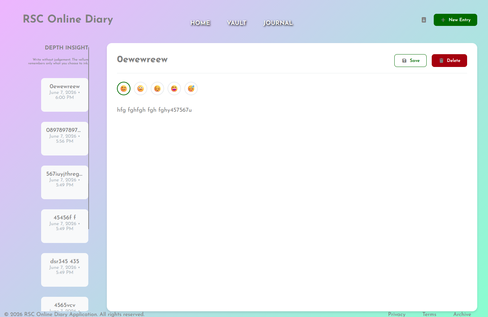
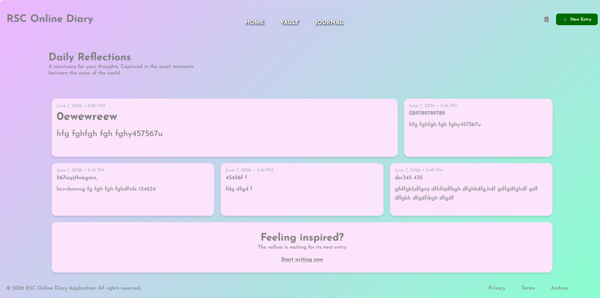
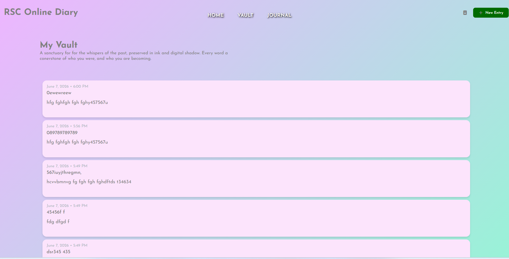
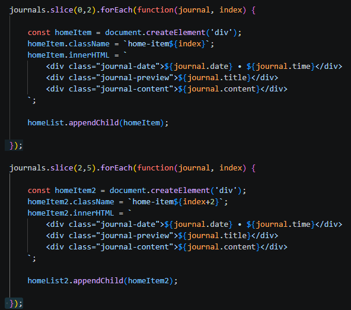
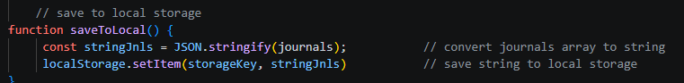
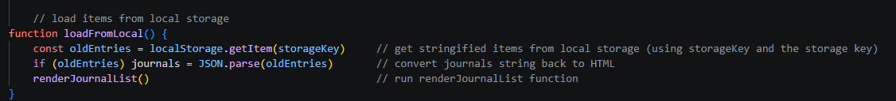
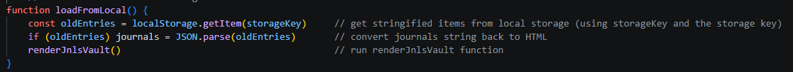
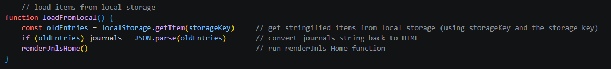

# RSC Online Diary App

Screenshots:

# "5 most recent Entries" logic:
I used the slice method (twice), once for the first 2 items (slice(0,2)) and displayed these in one particular style of div,
and I used another slice (slice (2,5)) to get the third, fourth & fifth items and display them in another style of div.

See here:

# Local Storage
https://developer.mozilla.org/en-US/docs/Web/API/Window/localStorage

In the script file for the new entry page, there is a function to save the "journals" array as a string in local storage:

This uses the JSON.stringify method and saves the stringified item as a sotrage key

There are also functions in all three script files to load (or get) the stringified items from local storage:

